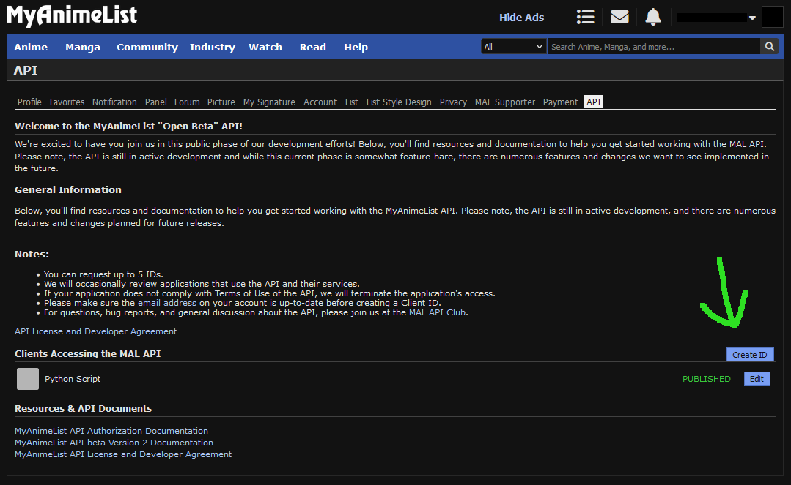

# Proxer_to_MAL_Import
This repositrory holds scripts, that will convert a manually exportet Proxer.me anime watchlist into an XML file for import in MyAnimeList.

## Requirements

- current version of Python (developed in Python 3.11)
- current version of [poetry](https://python-poetry.org/docs/master/#installing-with-the-official-installer)
- installation of dependencies (`poetry install`)
- a MAL Client ID

## Installation Guide

### Step 1

Install the newest version of Python on your system.

### Step 2

Install the newest version [poetry](https://python-poetry.org/docs/master/#installing-with-the-official-installer) on your system.

### Step 3

Create a Poetry Interpreter in your IDE. You may have to manually set the right path to the poetry executable, because
it can differ from the standard your IDE is proposing.

### Step 4

Either let your IDE install the dependencies or install them manually with `poetry install`.

### Step 5

To acquire a MAL Client ID you have to create it inside your MAL Account. In the Account settings under API you can find
the button ``Client ID``. You will have to fill out the form as described in step 0 of 
[ZeroCrystal's Blogpost](https://myanimelist.net/blog.php?eid=835707).


(This picture is inspired by [ZeroCrystal's Blogpost](https://myanimelist.net/blog.php?eid=835707) on MyAnimeList regarding the Authorisation Flow for the MAL API)

After successfully creating an ID, you can find it by clicking on the ``Edit`` button next to the created Client ID.

### Step 6

Set the environment variable `CLIENT_ID={ClientID}` in the templates of your IDEs run configuration for `Python`, where 
``{ClientID}`` is the ClientID you retrieved during Step 5.

## Installation Advices

When you are in the setup of your IDE's interpreter, you may choose the poetry environment. For this you may need to
change the poetry executable path to the path your system installed it to.

THIS PATH CAN DIFFER FROM THE STANDARD PATH PROPOSED BY YOUR IDE.

If you use an IDEA IDE you can find the interpreter settings in ```File\Project Structure```. There you can add a new
poetry SDK in case your IDE does not show you the prompt to do so.

## Data Preparation

To run the script you will need to prepare the data from Proxer.me that you will feed it with. Additionally, you will need
a template for the XML output file. There are three major
data files to prepare:

1. ``anime_list.txt``: holding most of the information of your watch list
2. ``ratings_raw.txt``: only used to parse the rating for every anime, since it is displayed in stars by Proxer.me
3. ``template.xml``: for the base of the xml we need a template consisting of an empty export of your MAL Anime Watchlist

### Prepare ``anime_list.txt``

To prepare the ``\data\anime_list.txt`` you will first need to gather the raw data. For this you need to log in to your
Proxer.me account and navigate to the Anime list in your User-Control-Panel (UCP). There you need to select the content
of all the tables and copy it into the ``\data\anime_list.txt`` file.

Then you will need to do some formatting:

1. Remove the leading ```Geschaut``` line. The lines indicating the next tables should stay (``Am Schauen``, ``Wird noch geschaut``, ``Abgebrochen``)
2. Remove every empty line.
3. Remove every line containing the table descriptors (``Name``, ``Medium``, ``Bew.``, ``Stand``, ``Optionen``).
4. Ensure that every anime is in the following format:

```
[Abgeschlossen] 	"Oshi no Ko" 	Animeserie
TV		11 / 11
```

### Prepare ``ratings_raw.txt``

To prepare the ``\data\ratings_raw.txt`` you will first need to gather the raw data. For this you need to log in to your
Proxer.me account and navigate to the Anime list in your User-Control-Panel (UCP). There you need to open the html source
code (Ctr + U in Windows) and copy it into the ``\data\ratings_raw.txt`` file.

Next you only need to remove every empty line in the file, and it is ready.

### Prepare ``template.xml``

To prepare the ``\data\template.xml`` you will need to log in to your MAL Account and navigate to your Anime Watchlist.
On the left side you can choose to export your watchlist. Next, you will need to copy the
following elements into the ``\data\template.xml`` file.

````
<?xml version="1.0" encoding="UTF-8" ?>
<!--
 Created by XML Export feature at MyAnimeList.net
 Version 1.1.0
-->

<myanimelist>

    <myinfo>
        <user_id>{yourUserID}}</user_id>
        <user_name>{yourUserName}</user_name>
        <user_export_type>1</user_export_type>
        <user_total_anime>1</user_total_anime>
        <user_total_watching>1</user_total_watching>
        <user_total_completed>1</user_total_completed>
        <user_total_onhold>0</user_total_onhold>
        <user_total_dropped>0</user_total_dropped>
        <user_total_plantowatch>0</user_total_plantowatch>
    </myinfo>

</myanimelist>
````

## Running the Script

The script parses the input files into dictionaries, containing all the relevant information of an anime. Then it uses
the MAL API to get the MAL entry for that anime, which contains the id needed for the ``mal_import.xml``. Last but not least
it creates the ``mal_import.xml`` from the ``template.xml`` and the created list of anime dictionaries.

Between all of these steps the dictionary is saved in ``\data\pickle.txt``. Additionally, it is saved in different text files
after each step. Those files (``anime_dic``, ``anime_dic_with_id``) are only good for debugging purposes though.

Run with poetry:

```shell
$ poetry run python main.py
```

### Finish

After the Script has successfully finished, there will be a generated ``\data\mal_import.xml``. Because of differences in
names, there will probably still some problems in the output file though. Every anime, where problems occured during the
script, will have an extra ``<error>{Name of Anime}: Some Error occured<\error>`` element.

The two errors displayed there are ``Name: needs to be checked``, indicating that the found anime on MAL was not exactly
named the same, and ``Name: : invalid q``, indicating that no anime was found with this name.

To fix this you will have to manually look up the Anime on MAL and check if the id contained in the ``<series_animedb_id>someID</series_animedb_id>``
element is correct. You can find the ID of an Anime in the URL of its MAL site. For Example in:

``https://myanimelist.net/anime/52034/Oshi_no_Ko``

You can find ``Oshi no Ko``'s ID between ``anime`` and ``Oshi_no_Ko``. Thereby, its ID is ``52034``.

### Known Issues

There are still some issues with this project:

1. Since Proxer.me does not provide a native solution to export the watchlist, the procedure to get the source files ``anime_list.txt`` and ``ratings_raw.txt`` is rather complicated.
2. As the MAL API is still in beta, the number of requests is artificially limited to 12 per minute (or one every 5 seconds). Otherwise, the API will block the requests because of TooManyRequests.
3. As there are some differences in names, one has to look through the ``maml_import.xml`` file for errors and fix them manually.

## License

This project is licensed under the MIT License - see the LICENSE.md file for details
